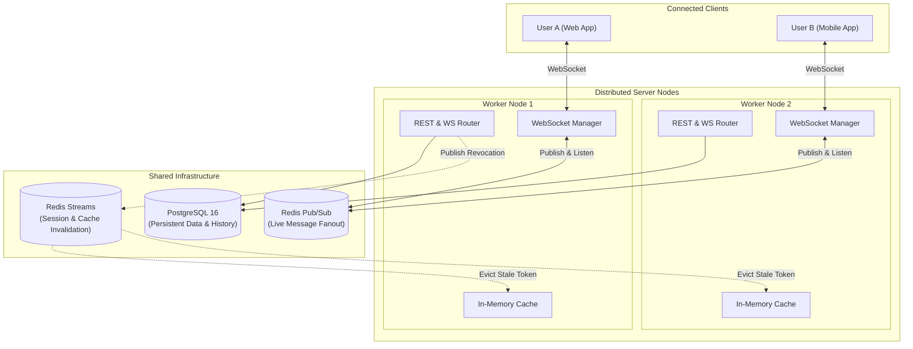
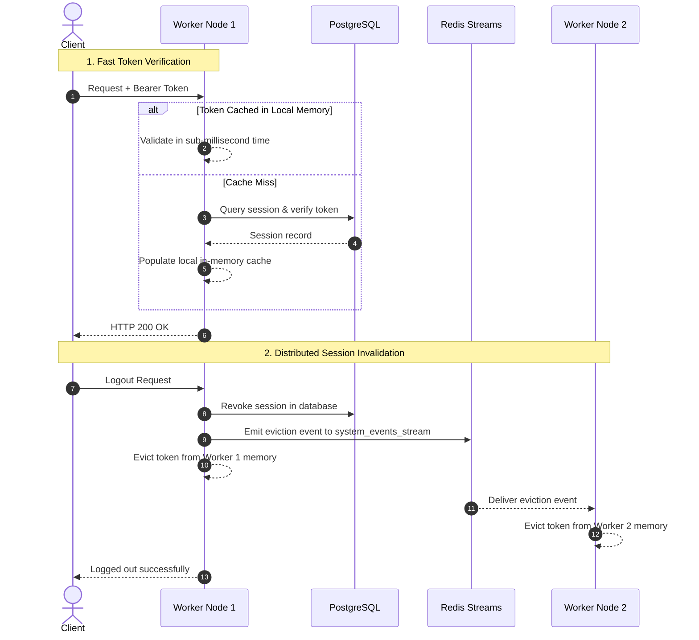
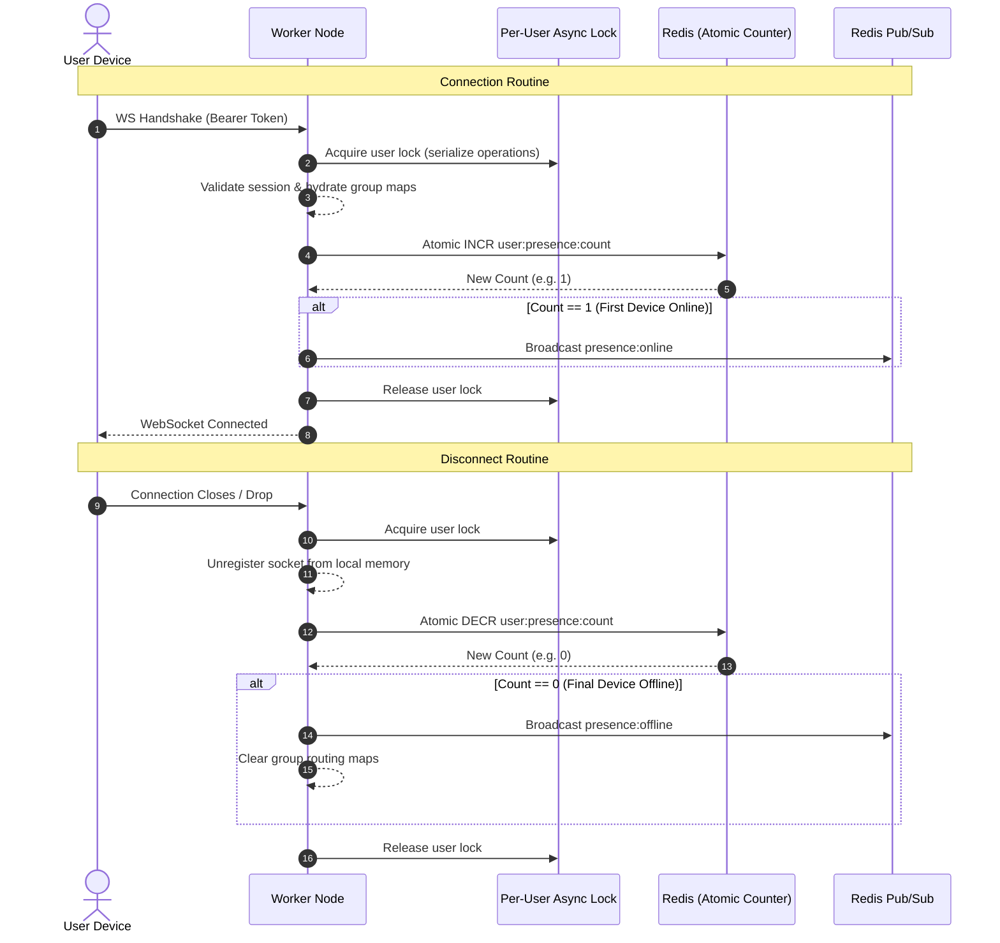
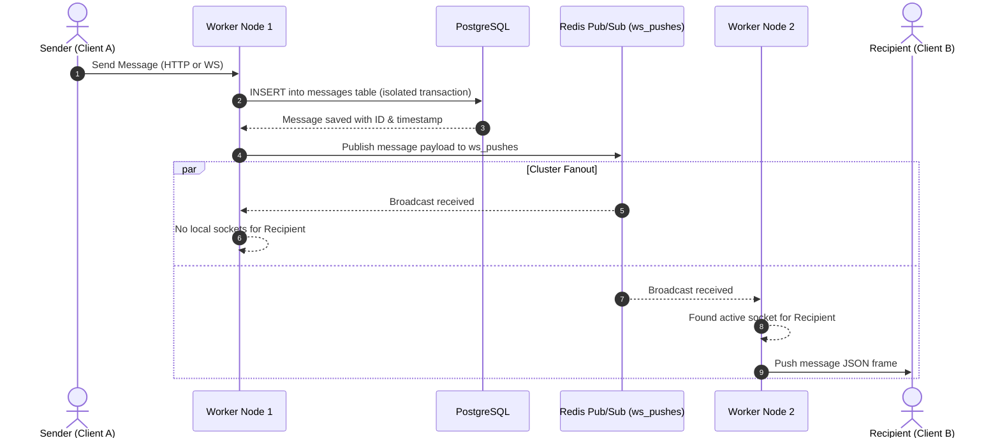
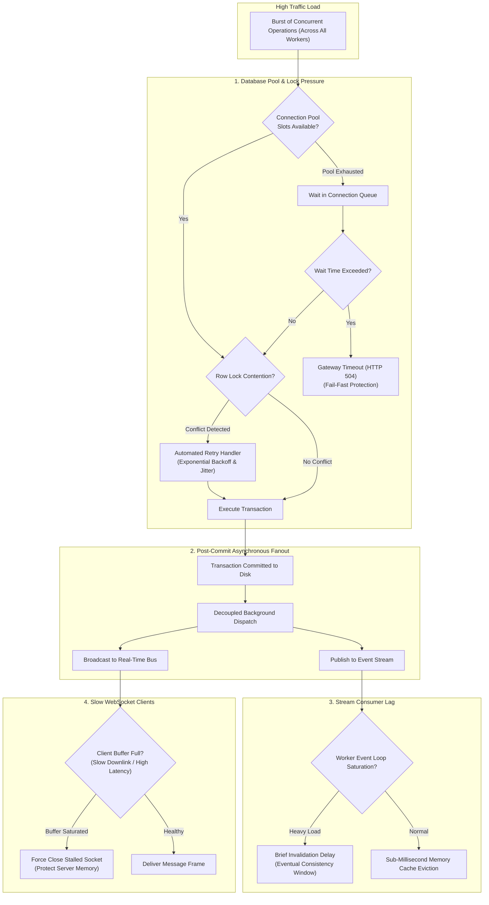

# Distributed Real-Time Messaging Engine

### 🔄 CI/CD Automation
[](https://github.com/mariosman06/messenger-backend/actions/workflows/code_check.yml)
[](https://github.com/mariosman06/messenger-backend/actions/workflows/test.yml)

### 🚀 Core & Runtime


### 🗄️ Storage & Async Bus


### 🛠️ Tooling & QA


A distributed real-time messaging engine built with Python, FastAPI, and Redis. It allows multiple backend servers to run together seamlessly—routing WebSocket connections locally while keeping user presence, chat messages, and session data synchronized across the entire cluster.

---

## Tech Stack

| Layer | Technology | Role & Key Details |
| --- | --- | --- |
| **API & WebSockets** | FastAPI & Python 3.13 | High-concurrency REST routing, async request lifecycles, and stateful WebSocket handshakes |
| **Async Concurrency** | Python `asyncio` | Event loop execution, background listener tasks (`asyncio.create_task`), scatter-gather frame dispatch (`asyncio.gather`), and per-user locking |
| **Database & Persistence** | PostgreSQL 16 + `asyncpg` | Relational storage, connection pooling, transactional advisory locks, and automated serialization retries |
| **Pub/Sub Message Bus** | Redis 7 (Pub/Sub) | Single-channel (`ws_pushes`) inter-worker fanout and reference-counted presence tracking (`HINCRBY`) |
| **Event Stream & Cache Sync** | Redis 7 (Streams) | Cursor-tracked `system_events_stream` for cluster-wide local cache invalidation and session revocation |
| **Cryptography & Security** | Argon2id + SHA-256 | Secure password hashing (Argon2id) and access token hashing (SHA-256) |
| **Worker Memory Cache** | `cachetools` (`TTLCache`) | Worker-local memory cache mapping token hashes to authenticated user sessions |
| **Tooling & Orchestration** | Docker, `just`, `uv` | Containerized dependencies, unified task runner (`justfile`), and fast virtual environment management |

---

## 1. System Architecture

Clients connect to any available server node. Real-time messages are synchronized between workers using Redis Pub/Sub, while cache invalidations are reliably streamed across nodes.



---

## 2. Core Flows & Sequence Diagrams

### A. Authentication & Cache Synchronization
* **Verification:** The worker first checks its local in-memory cache for the token. On a cache miss, it reads from PostgreSQL and populates local memory so subsequent requests validate in sub-millisecond time.
* **Invalidation:** When a user logs out, the handling worker marks the session revoked in PostgreSQL and publishes an event to Redis Streams (`system_events_stream`). All workers consume the event and instantly clear the token from their local memory.



---

### B. WebSocket Connection & Presence Lifecycle
* **Connect:** When a client opens a socket, the worker validates the token, hydrates group memberships, and atomically increments the user's online device count in Redis.
* **Presence:** A transition from `0 -> 1` broadcasts an `online` event across the cluster.
* **Disconnect:** When the socket closes, the counter decrements. If the count reaches `0`, the user is marked `offline` globally.



---

### C. Direct & Group Message Delivery
* **Persistence:** Messages are saved to PostgreSQL inside an isolated database transaction.
* **Fanout:** The message is published to the Redis Pub/Sub channel (`ws_pushes`). Every worker inspects the payload and delivers it directly to any matching local client sockets.



---

## 3. Concurrency, High-Scale Dynamics & Limits

### Routine Safeguards

* **Startup Race (Multi-Server Boot):**  
  * *Problem:* Multiple servers starting simultaneously could attempt to apply database schema migrations concurrently, causing catalog lock contention or duplicate execution.
  * *Solution:* A database session-level advisory lock coordinates initialization. Only one server claims the lock and executes the migration routine while sibling servers pause and wait for completion.
* **Token Rotation & Replay Attack Defense:**  
  * *Problem:* Rapid, duplicate credential refresh requests arriving at different worker processes at the exact same millisecond risk allowing multiple processes to read an active session state, issuing duplicate credentials and defeating rotation security.
  * *Solution:* Exclusive row-level write locks serialize concurrent requests attempting to rotate the same token. The first worker locks the record, invalidates the existing credential, issues a new credential pair, and commits the transaction. Any subsequent worker waiting on that lock unblocks, immediately reads the updated revoked state, and safely triggers the account-wide session revocation protocol.
* **Database Serialization Conflicts:**  
  * *Problem:* High volumes of concurrent writes to overlapping records can cause the database engine to abort conflicting transactions with serialization anomalies.
  * *Solution:* Transactional workflows are managed by an automated retry supervisor. When a concurrency conflict occurs, the system transparently retries the entire operation with randomized exponential backoff and jitter to prevent thundering herd contention.
* **Side-Effect Decoupling (No Phantom Broadcasts):**  
  * *Problem:* Emitting live real-time notifications or cache invalidation events from inside an uncommitted database transaction risks alerting users to operations that could still fail and roll back.
  * *Solution:* The architecture enforces a strict two-phase execution flow. Outbound real-time notifications and event stream dispatches are entirely decoupled from database transactions, executing as asynchronous background routines only after the database engine has acknowledged a successful, durable commit.
* **Connection Interleaving (Rapid Reconnects):**  
  * *Problem:* Unstable network connections can trigger simultaneous connect and disconnect sequences, risking race conditions and corrupted in-memory connection registries.
  * *Solution:* All connection lifecycle events for a given account are serialized through an asynchronous per-user lock, ensuring connection handshakes and cleanup routines execute in strict sequential order.
* **Multi-Device Presence:**  
  * *Problem:* Closing one device could mark an account as completely offline even if another device is actively connected.
  * *Solution:* Distributed atomic increment and decrement counters maintain an accurate total count of active sessions across the entire cluster without read-modify-write race conditions.
* **Multi-Entity Atomic Consistency:**  
  * *Problem:* Operations involving multiple related tables (such as provisioning a new group conversation and assigning its initial ownership) risk leaving orphaned records if a failure occurs halfway through.
  * *Solution:* Operations are bound within atomic transaction boundaries, guaranteeing that either the full entity graph persists to disk or all mutations roll back cleanly.

---

### Database Concurrency & Worker Coordination

Because the platform runs across multiple isolated operating system worker processes with independent event loops, application-level in-memory locks cannot synchronize state across the cluster. All concurrency controls, atomicity guarantees, and data consistency models are enforced directly at the database engine and connection pool levels:

* **Pessimistic Row Locking:** High-risk workflows (such as credential rotation, permission validation, and membership adjustments) apply exclusive row-level write locks. This guarantees that parallel requests targeting identical records are queued and evaluated sequentially rather than concurrently.
* **Transaction Isolation & Conflict Resolution:** The system operates under standard read-committed isolation for maximum throughput, while supporting strict serializable isolation where necessary. Transient concurrency anomalies and serialization aborts are captured and automatically recovered via exponential backoff retries.
* **Distributed Connection Pool Management:** Each worker process manages its own dedicated database connection pool, scaling from a baseline idle allocation up to a high-capacity burst limit per worker. All pool acquisitions and query executions enforce strict timeout ceilings to prevent connection starvation and cascading failures under heavy load.

---

### What Happens When Pushing the Server to Its Limits?

Under heavy traffic bursts or resource saturation, the system gracefully degrades across its layers to protect cluster stability:



* **Database Connection Pool Exhaustion & Timeouts:**  
  The database connection pool enforces an aggregate connection ceiling across all worker processes. If incoming operations arrive faster than the database engine can process them, they wait in a connection queue. If the wait duration exceeds established timeout ceilings, requests fail fast with a gateway timeout rather than allowing connection queues to back up and stall entire worker processes.
* **Row Lock Contention Queues:**  
  Under heavy concurrent requests on identical resources (such as simultaneous credential updates or group membership changes), transactions briefly queue on database row locks. Rather than producing race conditions, requests are processed in strict serial order, with any concurrency conflicts absorbed by the retry supervisor.
* **Eventual Consistency Creeps In:**  
  Under heavy CPU load or high message volume, background workers take slightly longer to process events from the distributed event stream. Revoked sessions or profile updates may take a moment to clear across every server node's local memory cache, temporarily shifting the cluster into an eventual consistency window until the event stream consumer catches up.
* **Broadcast Overhead at Scale:**  
  Because all servers listen to a shared pub/sub channel, every server inspects incoming message events to check whether the recipient is actively connected to its local process. Under massive traffic bursts, workers spend CPU cycles filtering out non-local messages, introducing slight latency to active request handling.
* **Slow Network Clients Get Dropped:**  
  If a client on a slow or unstable mobile network cannot download messages fast enough, its outgoing socket buffer fills up. To prevent the server from running out of memory holding backlogged messages, the server forcibly disconnects the lagging socket and reclaims allocated resources.

---

## Project Structure

```text
messenger-backend/
├── config/                  # Global environment & database configuration files
│   ├── messenger.example.yaml
│   └── postgres.conf
├── src/                     # Main application source code
│   ├── api/                 # FastAPI routing layer
│   │   ├── dependencies.py  # Shared route dependencies & injectables
│   │   ├── routers/         # Endpoint definitions (auth, groups, messaging, users, ws)
│   │   └── schemas.py       # Pydantic data validation models
│   ├── config/              # Application runtime settings & logger configuration
│   ├── crypto/              # Cryptographic utilities (password hashing, JWT/token logic)
│   ├── database/            # PostgreSQL layer (Raw SQL, connection pools, models, enums)
│   ├── redis/               # Redis layer (PubSub, connection pools, streams, event parsing)
│   ├── services/            # Business logic orchestration & domain service actions
│   ├── utils/               # Shared background tasks, ID generators, and timestamp helpers
│   └── main.py              # Application entrypoint (FastAPI initialization)
├── tests/                   # Automated testing suite
│   ├── e2e/                 # Multi-worker & cluster end-to-end simulations
│   ├── integration/         # Domain-specific API & module integration tests
│   └── load/                # Locust performance & capacity load test scripts
├── Dockerfile               # Production multi-stage Docker container build
├── docker-compose.yml       # Local development stack (PostgreSQL & Redis)
├── justfile                 # Command runner recipes for development workflow tasks
├── pyproject.toml           # Project dependencies & Python package configuration
├── README.md                # System documentation
└── uv.lock                  # Lockfile managed by uv for deterministic dependency resolution
```

---

## Local Development

### Prerequisites
* [Docker & Docker Compose](https://docs.docker.com/get-docker/)
* [uv](https://docs.astral.sh/uv/) (fast Python package installer)
* [just](https://github.com/casey/just) (command runner, optional)

### Quickstart

1. **Clone the repository:**
   ```bash
   git clone https://github.com/mariosman06/messenger-backend.git
   cd messenger-backend
   ```

2. **Install dependencies:**
   ```bash
   uv sync
   ```

3. **Configure Environment Settings**
    The application relies on a messenger.yaml file inside the config/ directory to manage database connections, authentication lifetimes, and logging behavior.

    Copy the provided template example:
    ```bash
    cp config/messenger.example.yaml config/messenger.yaml
    ```

4. **Start the backend server and infrastructure:**
   ```bash
   docker compose up -d postgres redis
   ```

### Running Tests & Quality Checks

```bash
# Run linting and formatting
just check

# Run automated tests
just test

# Run load tests with Locust
just load-test
```
