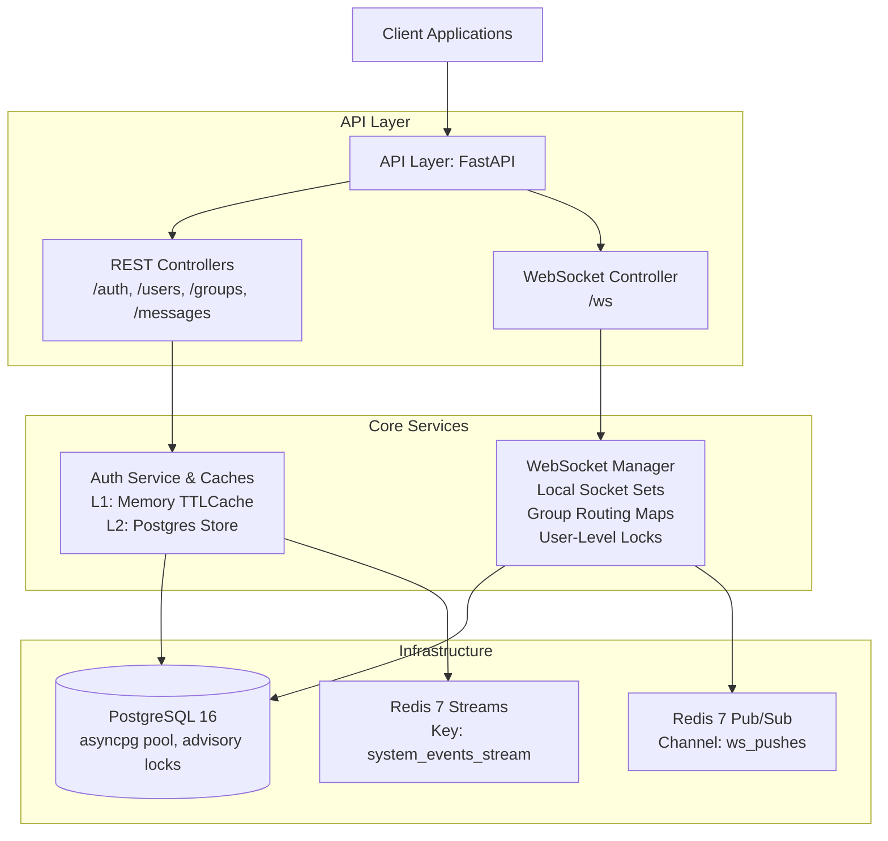
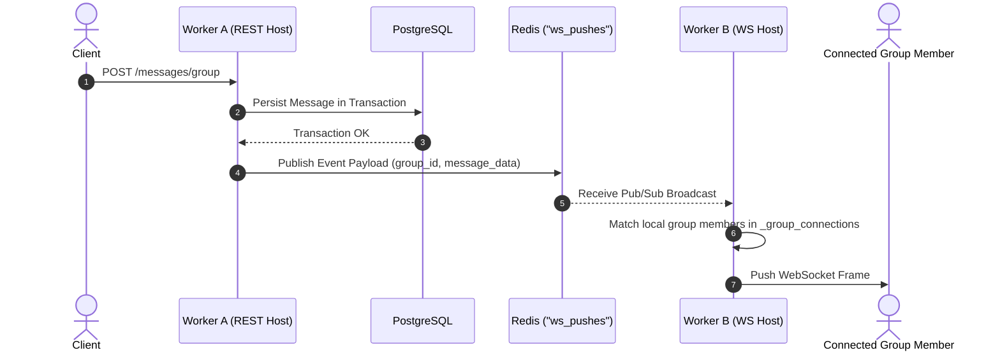
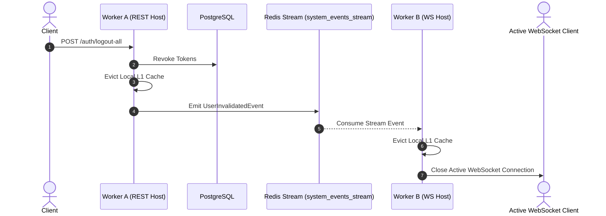

# Distributed Real-Time Messaging Engine

A high-throughput, horizontally scalable messaging and presence backend designed for multi-worker distributed setups. The system pairs FastAPI stateful WebSocket connections with a single-channel Redis Pub/Sub broadcast bus, asyncpg connection pooling, and a two-tier authentication strategy with cluster-wide cache invalidation.

---

## Tech Stack

| Layer | Technology | Role & Key Details |
| --- | --- | --- |
| **API & WebSockets** | FastAPI (Python 3.13) | REST API endpoints and stateful WebSocket connection handling |
| **Database** | PostgreSQL 16 (`asyncpg`) | Parameterized SQL execution, connection pooling, startup advisory locks, and serialization retries |
| **Messaging & Presence** | Redis 7 (Pub/Sub) | Single-channel (`ws_pushes`) inter-worker fanout and atomic user presence reference counting |
| **State Consistency** | Redis 7 (Streams) | Replayable `system_events_stream` for cross-worker L1 cache invalidation and session termination |
| **Authentication** | Argon2id + `TTLCache` | L1 worker-local memory caching for 0ms token validation, backed by L2 PostgreSQL persistent storage |
| **Tooling** | Docker, `just`, `uv` | Containerized services, unified command runner, and fast dependency management |

---

## Business & Action Flows

### 1. Authentication & Session Lifecycles

* **Login:** User submits valid credentials. System issues access and refresh tokens, recording the active session.
* **Request Verification:** Incoming requests present a token. Workers check their fast local session store first; if absent, they fall back to the central database and populate local memory for future requests.
* **Logout & Revocation:** User logs out or changes credentials. The handling worker revokes the token locally, updates persistent storage, and emits a cluster event so all other server nodes immediately drop the revoked session.

### 2. WebSocket Connection Lifecycle

* **Connect & Hydrate:** Client initiates a WebSocket connection with a session token. Once authenticated, the server loads the user's active group memberships, registers the connection, and increments their global online device count.
* **Active State:** The client receives real-time direct messages, group chats, and membership updates pushed by the server cluster.
* **Disconnect:** Client closes the socket. The server unregisters the connection. When a user's final connected device drops off, their group routing maps are cleared and their global presence status updates to offline.

### 3. Direct & Group Message Delivery

* **Submission:** A user sends a message via HTTP endpoint or WebSocket connection.
* **Persistence:** System saves the message to the database chat history inside an isolated transaction.
* **Broadcast:** System dispatches the message to all server nodes. Each node delivers the payload to any local connected sockets belonging to the recipient or group members.

---

## Technical Layer Breakdown



* **API Layer:** Handles HTTP routing, JSON serialization (`ORJSONResponse`), request trace correlation (`contextvars`), and WebSocket handshake validation.
* **Auth Service & Caches:** Provides a two-tier caching pipeline. L1 is an in-memory `TTLCache` mapping token hashes to user models for instant authentication. L2 queries PostgreSQL on L1 cache misses.
* **WebSocket Manager (`WebSocketManager`):** Tracks stateful client sockets per worker using three in-memory registries (`_local_connections`, `_group_connections`, `_user_groups`). Synchronizes socket operations using `weakref.WeakValueDictionary` locks.
* **Database Manager (`DatabaseManager`):** Encapsulates `asyncpg` pooling. Runs database initialization under PostgreSQL advisory locks (`pg_advisory_xact_lock`) and wraps concurrent operations in automated serialization retry loops.
* **Redis Engine:** Handles single-channel Pub/Sub fanout (`ws_pushes`), atomic presence counting (`HINCRBY`), and a cursor-tracked stream listener (`system_events_stream`) for reliable cross-worker cache invalidation.

---

## Systems Interaction & Multihop Scenarios

### Scenario A: Group Message Sent via HTTP REST Across Workers



### Scenario B: Multi-Device Session Invalidation



---

## Concurrency Control & State Consistency

* **User Lock Granularity:** Socket registrations and deregistrations use an `asyncio.Lock` bound per user via `weakref.WeakValueDictionary`. Operations on one user never block another, and unused locks are garbage collected automatically.
* **Database Serialization Protection:** Write operations prone to concurrent race conditions run inside transaction retry wrappers that intercept `asyncpg.SerializationError` and retry with exponential backoff.
* **Startup Initialization Lock:** DDL migrations run behind a PostgreSQL advisory lock (`pg_advisory_xact_lock`), preventing parallel worker deployments from executing conflicting database schemas.
* **Atomic Presence Tracking:** Multi-device user presence is tracked via Redis atomic counters (`HINCRBY`). A user is marked offline only when their active socket count reaches zero.
* **Consistency & Load Trade-offs:**
* **Global Channel Fanout:** All worker nodes subscribe to the single `"ws_pushes"` Redis channel and filter incoming payloads against their local routing tables. At massive cluster scales, this increases worker CPU overhead compared to per-entity channel subscriptions.
* **Delivery Ordering under Load:** Frame broadcasts to individual sockets rely on un-ordered concurrent tasks (`asyncio.gather`). Under high network load or socket pressure, message delivery order to the client UI can vary slightly unless client-side sequence numbers are applied.


---

## Setup & Development Environment

### 1. Launch Environment

Start PostgreSQL 16 and Redis 7 dependencies:

```bash
docker compose up -d

```

### 2. Task Runner Commands (`justfile`)

```just
format:
    uv run ruff format src/ tests/    

lint: 
    uv run ruff check --fix src/ tests/

check:
    just format
    just lint

test:
    uv run -m pytest tests/ -v

load-test users="300" rate="20" duration="30s" host="http://127.0.0.1:8008" pre_register="3000":
    uv run -m locust -f tests/load/locustfile.py \
        --headless \
        --users {{users}} \
        --spawn-rate {{rate}} \
        --run-time {{duration}} \
        --host {{host}} \
        --pre-register {{pre_register}}

```

#### Run Formatting and Linting

```bash
just check

```

#### Execute Test Suite

```bash
just test

```

#### Run Load Testing

```bash
# Run default headless load test
just load-test

# Run custom load test
just load-test users="1000" rate="50" duration="1m" host="http://127.0.0.1:8000"

```
